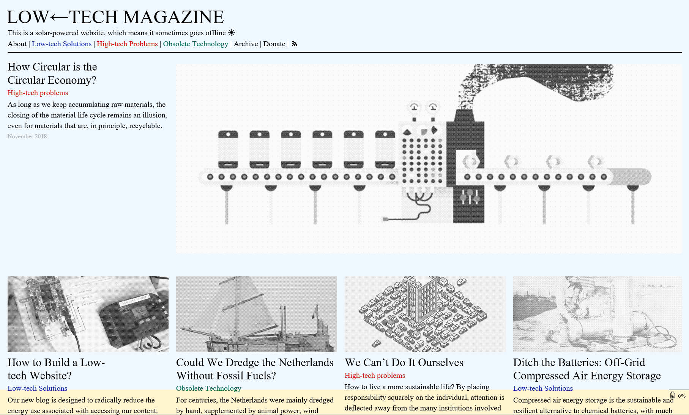

# Journal

### Alternative forms

#### 1. Low-Tech Magazine ([link](https://solar.lowtechmagazine.com))

I came across this website by accident - I was exploring the web for lighter website designs after I some concern with the size of my personal homepage. I came across this [7kb WordPress theme](https://sustywp.com/) with the nav on a separate page and no images. This blog talked about the real energy costs of a website, and this led me to the rabbit hole of energy efficient hosting whereupon I stumbled onto Low Tech mag.

This project _deeply_ fascinates me. There's the wonderful connection to the real world that I fear the web has completely lost. It's grown so large that the web as a universe need not refer to anything this side of the screen. And yet this website keeps you keenly aware of the sunshine a little solar panel is receiving over in Barcelona, and how many other people must be browsing at once as the battery trickles down.

Note how in the screenshot above, the site is mere minutes away from going offline. The site died midway though writing the following paragraph.

> To focus on energy efficiency is to make present ways of life non-negotiable.

I like how LTM has come to the same design choices (dithered, grayscale images; tiny page sizes with minimal CSS, no custom fonts & few extraneous assets) as sites from the early days of the internet - yet with the constraint of power consumption instead of end-user processing power and internet speed.

In the context of this project, a web run on machines dependant on the weather, or some other decidedly _non-techie_ thing, is a path I mean to explore.

#### 2. Dat Protocol ([link](https://datproject.org/))

This is again an exploration of an extant alternative form to the net - in this case sites hosted by many individuals freely giving bandwidth to keep other sites alive.

A project I'm familiar on the decetralized network is that of Devine Lu Linevega's [_Rotonde_](dat://2f21e3c122ef0f2555d3a99497710cd875c7b0383f998a2d37c02c042d598485/). It's a 'webring' of artists and like-minded people (to Devine) functioning akin to Twitter. A neat and somewhat successful experiment with the medium.

It's almost unbroken ground here. The platform is so far in it's infancy all one can find are little experiments and personal blogs, with maybe the odd whitepaper from some other crypto currency of the like.

In the same vein, I've come across the [Open Bazaar Project](https://openbazaar.org/); a browser, protocol and ecommerce site rolled into one. It uses bitcoin to buy and sell things anonymously. This would seem ideal for drug trading, but that's curiously absent from the very polished homepage demo.

#### 3. "Sneakernet" ([wikipedia](https://en.wikipedia.org/wiki/Sneakernet))
A close relative of _dead drops_ and the like; the sneakernet is the notion of data transimission via physical transportation of the data to another place - to use your sneakers to walk to the destination.

### Play on the Web

### Directions

---

Following our discussion of the above, I've been exploring morality on the web. I feel like this project is a complete hounour and gift to be able to do. I'm very glad I can explore the web like this.
